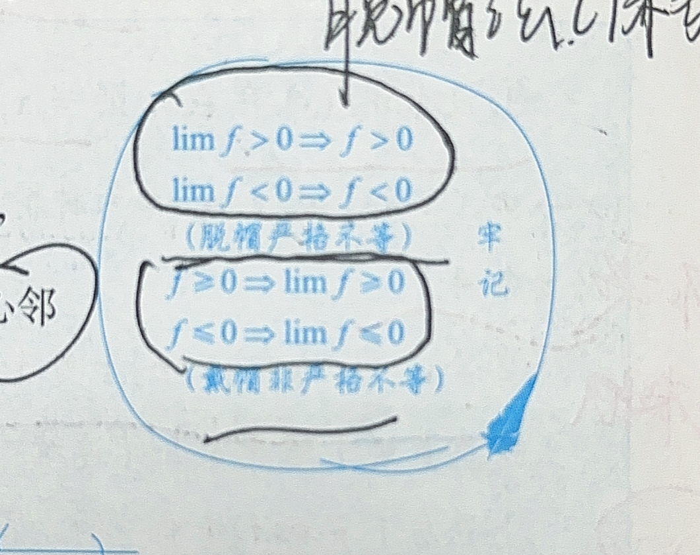
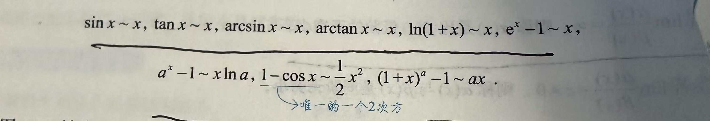
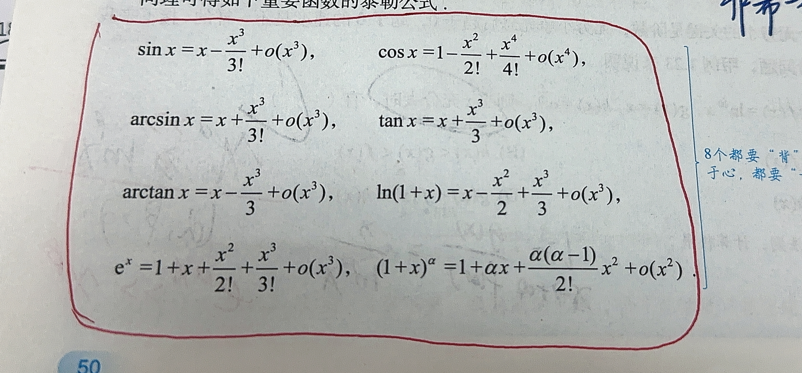

**复合函数，原函数求解**

函数数形结合

**有界性**
函数有界性，有界必须指定区间，无区间限制无法谈有界性
常用不等式
 对于非负实数 $a, b$：

  $$\frac{a + b}{2} \geq \sqrt{ab} \quad (a \geq 0, , b \geq 0)$$

  等号成立条件：$a = b$

  一般形式（$n$ 个正数）：

  $$\frac{a_1 + a_2 + \cdots + a_n}{n} \geq \sqrt[n]{a_1 a_2 \cdots a_n}$$

$$\sqrt{\frac{a^2 + b^2}{2}} \geq \frac{a + b}{2} \geq \sqrt{ab} \geq \frac{2}{\frac{1}{a} + \frac{1}{b}}$$

  即：

  $$\text{平方平均} \geq \text{算术平均} \geq \text{几何平均} \geq \text{调和平均}$$

**单调性**

**奇偶性**

内偶则偶，内奇同外（复合类型）
求导，积分过后，奇偶性质要变

**周期性**

基本初等函数的最值

$\sqrt{u}$（其中 $u \geqslant 0$）与 $u$ 的最值点相同。
$\sqrt[3]{u}$ 与 $u$ 的最值点相同。
对任意实数 $u$，恒有  对任意实数 $u$，恒有
对任意实数 $u$，恒有
  \[
      |u| = \sqrt{u^{2}},
  \]
  设 $u_1, u_2, u_3 > 0$，则
  \[
      \ln(u_1\, u_2\, u_3) = \ln u_1 + \ln u_2 + \ln u_3.
  \]
 *取对数后求解最值需要用求导法*
  
  设 $u(x) > 0$，则 $\dfrac{1}{u}$ 与 $u$ 的最值点相同，但最大与最小互换
  
自然对数 e = 2.71

三角函数 一拱面积为2
sinx，cosx均以2π为最小正周期，二者皆有界
$$\sin^{2}\theta + \cos^{2}\theta = 1$$
平方和公式的逆用

**正余切函数**
$$\tan\theta = \frac{\sin\theta}{\cos\theta}, \qquad \cot\theta = \frac{\cos\theta}{\sin\theta}$$

均为奇函数，最小正周期皆为π

**$$\sec^{2}\theta = 1 + \tan^{2}\theta, \qquad \csc^{2}\theta = 1 + \cot^{2}\theta$$**

$$\arcsin x + \arccos x = \frac{\pi}{2}, \qquad x \in [-1,,1]$$

 *注：此处不是分段函数*

#### 函数极限与连续
**去心邻域，无限逼近**
在有关于极限计算的过程中，要时刻记得等价无穷小的替换还有泰勒展开公式的运用。

**极限存在则唯一**

#### 极限存在的充要条件
左右极限相等
 $$\lim_{x \to x_0} f(x) = A \iff f(x) = A + \alpha(x), \quad \lim_{x \to x_0} \alpha(x) = 0$$
 此处是超实数的概念，即为无穷小。

  $$\textbf{定理（极限的局部有界性）}：若 \lim_{x \to x_0} f(x) = A，则 f(x) 在 x_0 的某去心邻域内有界。$$

  即：存在 $\delta > 0$，当 $0 < |x - x_0| < \delta$ 时，$|f(x)| \leq M$。

  M必须是一个确定的数。

  这是充分条件，无法证明有界一定存在极限。

 连续函数在其连续的闭区间上必有界
 
 #### 函数在开区间上连续，且左端点存在左极限，右端点存在右极限，则证明该函数在开区间内有界

局部保号性
脱帽法
$$\lim_{x \to x_0} f(x) = A > 0 \Rightarrow \exists \delta > 0, \forall x: 0 < |x - x_0| < \delta, f(x) > 0$$

  反向同理：

  $$\lim_{x \to x_0} f(x) = A < 0 \Rightarrow \exists \delta > 0, \forall x: 0 < |x - x_0| < \delta, f(x) < 0$$

  即：极限大于零，则函数在去心邻域内保持正号；极限小于零则保持负号。
  

无穷小的比阶数
高阶无穷小：
  $$\lim_{x \to x_0} \frac{\alpha(x)}{\beta(x)} = 0 \Rightarrow \alpha(x) = o(\beta(x))$$

  低阶无穷小：
  $$\lim_{x \to x_0} \frac{\alpha(x)}{\beta(x)} = \infty \Rightarrow \alpha(x) \text{ 是 } \beta(x) \text{
  的低阶无穷小}$$

  同阶无穷小：
  $$\lim_{x \to x_0} \frac{\alpha(x)}{\beta(x)} = c \neq 0 \Rightarrow \alpha(x) \text{ 与 } \beta(x) \text{
  是同阶无穷小}$$

  等价无穷小：
  $$\lim_{x \to x_0} \frac{\alpha(x)}{\beta(x)} = 1 \Rightarrow \alpha(x) \sim \beta(x)$$

  k 阶无穷小：
  $$\lim_{x \to x_0} \frac{\alpha(x)}{[\beta(x)]^k} = c \neq 0 \Rightarrow \alpha(x) \text{ 是 } \beta(x) \text{ 的 } k
  \text{ 阶无穷小}$$

##### 不是所有无穷小都可以比阶数，也存在比阶后极限不存在的情况。

##### 泰勒公式
泰勒公式（带拉格朗日余项）：
  $$f(x) = f(x_0) + f'(x_0)(x - x_0) + \frac{f''(x_0)}{2!}(x - x_0)^2 + \cdots + \frac{f^{(n)}(x_0)}{n!}(x - x_0)^n +
  R_n(x)$$
  麦克劳林公式（$x_0 = 0$ 的特例）：
  $$f(x) = \sum_{k=0}^{n} \frac{f^{(k)}(0)}{k!} x^k + o(x^n)$$
  

#### 函数间断与连续（较为薄弱）
极限值等于函数值，则称函数在该点连续。
存在讨论左右极限，左右极限相等等于函数值，连续。
关于连续的四则运算

两连续函数都在同一点连续，则在该点两函数相加减，相乘和x不为零时相除都是连续的。

复合函数若内外层都在该点连续，则复合函数也在该点连续。

反函数（单调必有反函数），函数单调连续，则反函数在相同区间上也连续且具有相同的单调性质。

第一类间断点（左右极限均存在）：
  $$\text{可去间断点：} \lim_{x \to x_0^-} f(x) = \lim_{x \to x_0^+} f(x) \neq f(x_0) \text{（或无定义）}$$
  $$\text{跳跃间断点：} \lim_{x \to x_0^-} f(x) \neq \lim_{x \to x_0^+} f(x)$$

  第二类间断点（左右极限至少一个不存在）：
  $$\text{无穷间断点：} \lim_{x \to x_0} f(x) = \infty$$
  $$\text{振荡间断点：如 } f(x) = \sin\frac{1}{x}, x_0 = 0$$

#### 注：判断间断点的时候一定要带入极限计算，不要直接看。